1.	Make sure you have the latest Postman app https://www.postman.com/downloads/ 
2.	Under Collections, click “+”
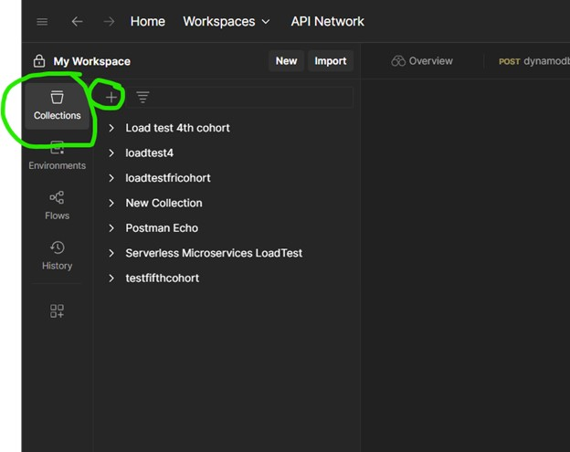

Then click “Blank Collection”
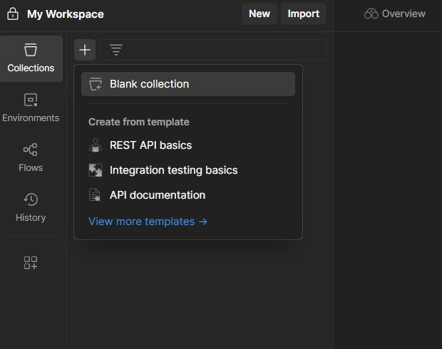
 

Give a name

Click “Add a request”

 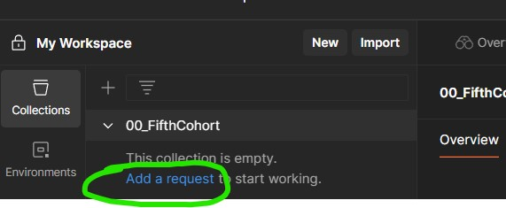

IMPORTANT: Make sure to change “GET” to “POST”, and paste the API Gateway POST URL

Click “Body” then “raw” and paste:

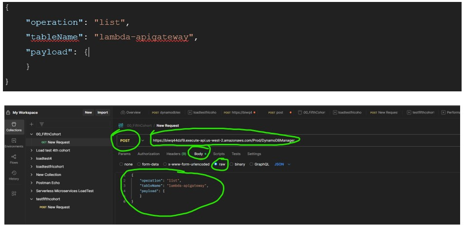

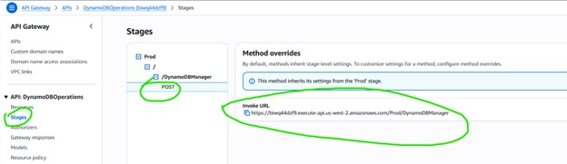
 

 

IMPORTANT: CLICK SAVE, ELSE IT WILL NOT SAVE!

 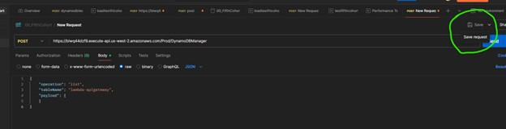

Validate: The request should change to POST, under the collection on left

 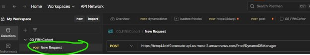

Now we are all set to run performance testing! 

Click “...” in the collection name, and from the drop down click “Run”

 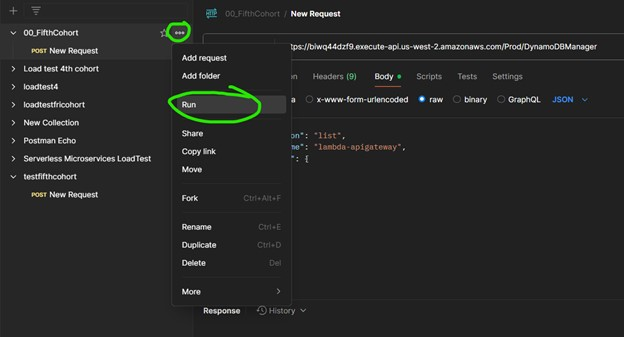

Click “Performance”, then select “Ramp up” under Load Profile, select “10” in Virtual users, and Test duration as 2 mins. Click Run!

 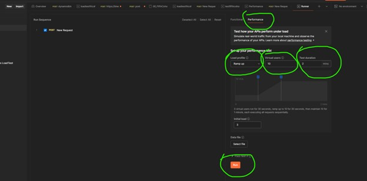

Let it run for 2 mins, enjoy the show:

  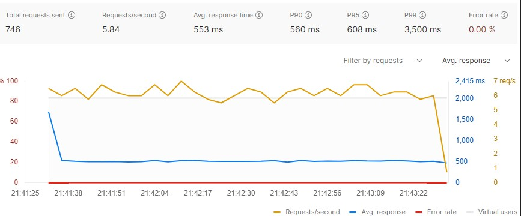

After 2 mins is over and the run completed, click “...”, and download pdf. So, this is initial test, note the average response time in pdf. Here it is 533 ms

 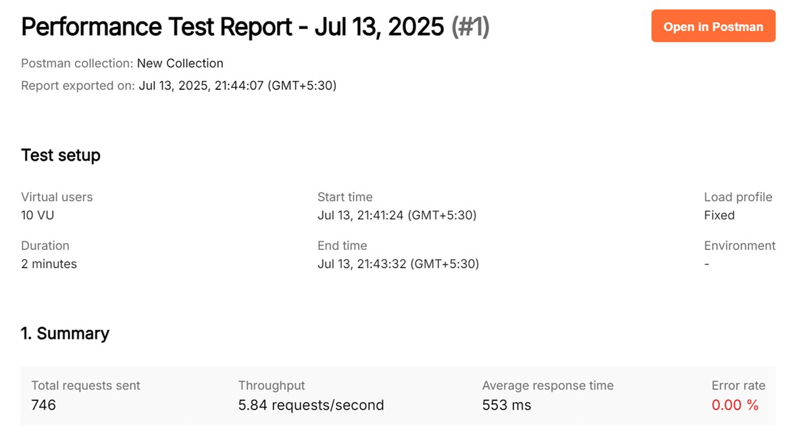

 

Now, let’s improve performance! Change the Lambda memory from 128 to 1024 MB under configuration, change timeout to 5 secs, save. So now  

  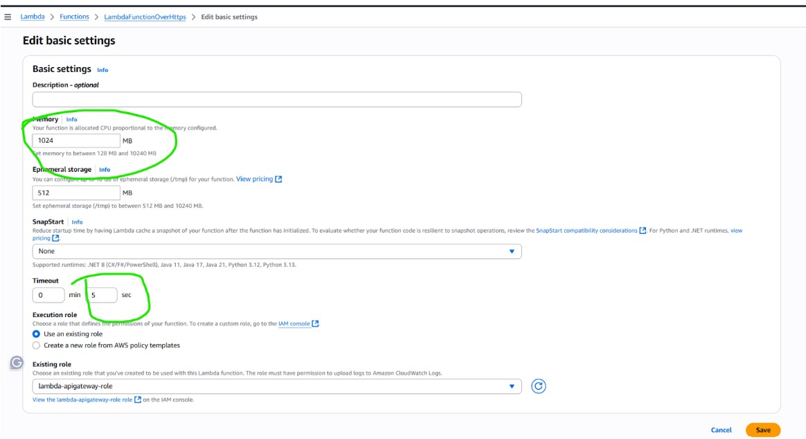

As we increase Lambda memory, it gets more vCPU (mapping below)

   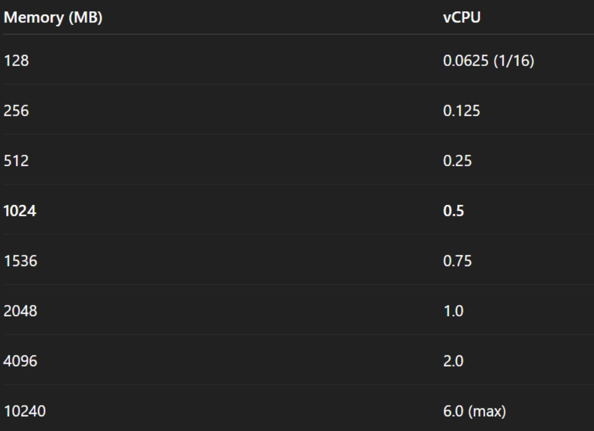

Now that our Lambda has 0.5 vCPU instead of 0.0625, it should perform faster. Let’s test it out

Go back to postman, and click “Run Again”

 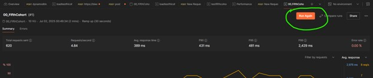

And this time, response time came down because Lambda has more memory and vCPU

 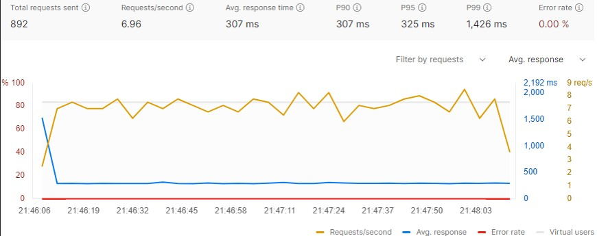
  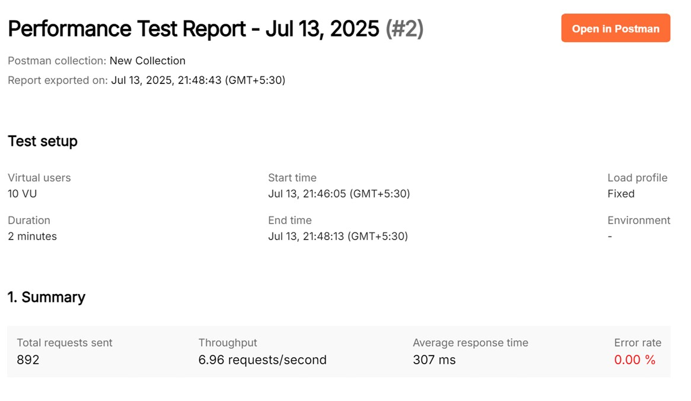
 

Customers run Lambda Power Tuning (https://github.com/alexcasalboni/aws-lambda-power-tuning) or check Lambda Insights, after it runs through a few iterations, to determine optimal Lambda memory. But this test gives you a taste of how tweaking Lambda memory based on load testing can drastically improve performance.

Save both PDFs, and use for LinkedIN
